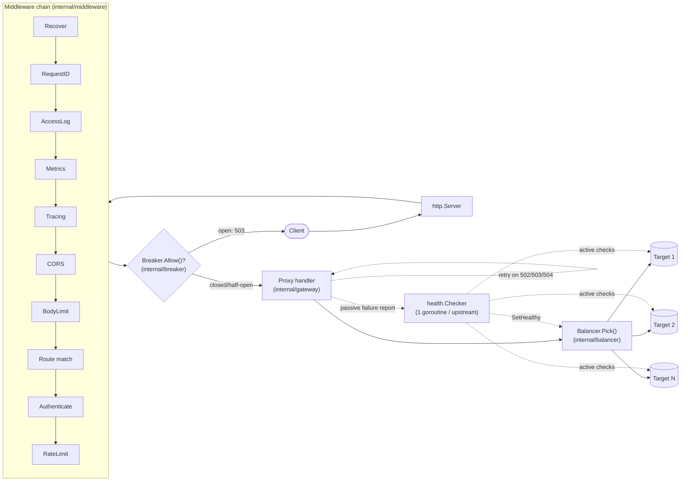

# gatekeeper

An API gateway (reverse proxy) written in Go, with a hand-rolled load
balancer, rate limiter, circuit breaker and health checker — no
off-the-shelf implementations for any of those. It's a portfolio project
built to a middle-level Go interview bar: every concurrency primitive
(atomics, mutexes, `context`, goroutine lifecycles) is used deliberately
and is meant to be explainable, not just "it works."

[](https://github.com/rosali3/gatekeeper/actions/workflows/ci.yml)

> **Status: work in progress**, built stage by stage. This README reflects
> what's actually implemented today, not the final target — see
> [Roadmap](#roadmap) for what's still missing.

## What it does today

- Routes requests by host / path prefix / method, longest-prefix-wins,
  with `strip_prefix` support.
- Load-balances across targets with three hand-written algorithms:
  `round_robin` (atomic counter), `weighted_round_robin` (nginx-style
  smooth weighted round robin), `least_conn` (atomic active-connection
  counter).
- Active health checks (one goroutine per upstream, jittered interval,
  configurable healthy/unhealthy thresholds) and passive health checks
  (a proxy error counts toward the same threshold as a failed probe).
  Unhealthy targets are skipped by every balancer; an upstream with no
  healthy target returns `503` without attempting to dial anything.
- Per-upstream timeouts via `context.WithTimeout`, so a client
  disconnecting propagates to the in-flight upstream call for free.
- `X-Forwarded-For/Proto/Host` and `X-Request-ID` (generated if absent),
  hop-by-hop header stripping — all via `net/http/httputil.ReverseProxy`,
  not reimplemented.
- Request body size limits, panic recovery (a handler panic becomes a
  500, not a crashed process), and graceful shutdown that waits for
  in-flight requests before closing.
- CORS for explicitly allow-listed origins.
- Structured JSON access logs (`log/slog`) with route/upstream/target/
  status/latency/request_id.
- Rate limiting per route, by IP or API key: a local sharded/janitored
  token bucket, or a Redis-backed one (atomic Lua script) shared across
  multiple gateway instances. `429` responses carry `RateLimit-Limit/
  Remaining/Reset` and `Retry-After`; a Redis outage fails open or closed
  per `rate_limit.fail_open`.
- Auth per route: API keys (`X-API-Key`, SHA-256 hashes compared with
  `subtle.ConstantTimeCompare`, never the raw key stored) or JWT (JWKS
  signature verification, TTL-cached with an immediate refresh on an
  unknown `kid`, fixed asymmetric-algorithm allow-list so `alg: none`/
  algorithm confusion can't get through, iss/aud/exp/nbf checked). A
  valid JWT's `sub` is forwarded upstream as `X-User-ID`.
- A circuit breaker per upstream (closed → open → half-open) over a
  bucketed sliding window of failures; open trips return `503` without
  ever dialing the upstream. Idempotent-method requests (or any method,
  if `only_idempotent: false`) retry on another target for network
  errors/502/503/504, capped by both `retries.max` and a retry budget
  (retries ≤ `budget_ratio` of recent request volume) so a struggling
  upstream can't be hit with a multiplying retry storm.
- Hot reload on SIGHUP, on the config file changing on disk (debounced
  fsnotify), or via `POST /admin/reload`. A reload that fails to parse/
  validate leaves the running config untouched; one that succeeds swaps
  in atomically, reusing the exact same balancer/breaker/retry-budget/
  rate-limiter state for any upstream or route whose config didn't
  actually change (so in-flight breaker trips, health status and
  token-bucket contents survive a reload of *other* parts of the config).
- A separate admin API (own port, Bearer token): `GET /admin/routes`,
  `GET /admin/upstreams` (per-target health/active-conns + breaker
  state), `POST /admin/reload`, plus unauthenticated `GET /healthz`,
  `/readyz`, `/metrics` (Prometheus).
- All eight metrics from the spec (`gateway_requests_total`,
  `..._request_duration_seconds`, `..._upstream_duration_seconds`,
  `..._ratelimit_rejected_total`, `..._circuit_state`,
  `..._upstream_healthy`, `..._retries_total`,
  `..._active_connections`), recorded at the point each happens except
  health/breaker state, which get polled every 5s since they're ongoing
  conditions rather than one-off events. OpenTelemetry tracing:
  incoming `traceparent` is extracted, a span started, and an updated
  `traceparent` injected into the outbound upstream request - no
  exporter wired yet (that's the docker-compose/Jaeger stage), so spans
  propagate correctly today but aren't shipped anywhere yet.

## Architecture



Each config generation compiles into one immutable `gateway.Snapshot`
(route table + per-upstream balancers/proxies + the fully assembled
handler chain) held behind an `atomic.Pointer`. A reload builds a new
Snapshot and swaps it in atomically - requests already in flight keep
using the old one, and unchanged upstreams/routes carry their runtime
state (balancer target health, breaker state, rate-limiter buckets)
straight into the new Snapshot instead of starting fresh.

## Quickstart

Requires Go 1.25+.

```bash
go build -o bin/gatekeeper ./cmd/gatekeeper
go build -o bin/testupstream ./cmd/testupstream

# two fake backends
ADDR=:9001 NAME=backend-1 ./bin/testupstream &
ADDR=:9002 NAME=backend-2 ./bin/testupstream &

ADMIN_TOKEN=demo-admin-token ./bin/gatekeeper --config=configs/gatekeeper.example.yaml &

curl http://localhost:8080/api/floorplan/rooms
curl -H "Authorization: Bearer demo-admin-token" http://localhost:9090/admin/upstreams
```

`gatekeeper` refuses to start if the env var named by `admin.token_env`
(`ADMIN_TOKEN` above) is unset or empty - an admin API with no real
token isn't worth serving.

`testupstream` is a small backend with configurable behavior via env vars
(`DELAY`, `ERROR_RATE`, `HEALTHY`) — handy for poking at load balancing,
timeouts and health-check eviction/recovery by hand.

## Configuration

See [`configs/gatekeeper.example.yaml`](configs/gatekeeper.example.yaml)
for a full example. Config is strict: unknown fields are a startup error,
not a silently ignored typo.

```yaml
upstreams:
  floorplan:
    balancer: least_conn
    targets:
      - { url: http://floorplan-api-1:8080, weight: 1 }
      - { url: http://floorplan-api-2:8080, weight: 1 }
    health_check: { path: /healthz, interval: 5s, timeout: 1s, healthy_threshold: 2, unhealthy_threshold: 3 }
    timeout: 30s
routes:
  - match: { path_prefix: /api/floorplan/, methods: [GET, POST] }
    strip_prefix: /api/floorplan
    upstream: floorplan
    auth: jwt
```

## Middleware order, and why

```
recover → request-id → access-log → metrics/tracing → CORS → body-limit → route-match → auth → rate-limit → circuit-breaker → proxy (+retries)
```

- **recover** is outermost so it can catch a panic from every layer below it.
- **request-id** runs early so every later log line and the upstream
  request itself carry it.
- **access-log** wraps everything downstream of it (CORS, body-limit,
  routing, proxying) so it can report the final status/route/upstream/
  target after the whole chain has run.
- **metrics/tracing** sit right after logging, per the spec's own order -
  metrics needs the same "wraps everything downstream" shape as
  access-log (to read the final route/status), and tracing needs to
  start its span before anything downstream can use it.
- **CORS** and **body-limit** are cheap, request-shape checks that should
  reject bad requests before spending effort on routing or auth.
- **route-match** has to happen before auth/rate-limit/circuit-breaker
  because those are configured per-route.
- **auth** must reject before **rate-limit** spends a token on a request
  that was going to be denied anyway.
- **circuit-breaker** is checked right before proxying - an open breaker
  must short-circuit before dialing anything, which is also why it's
  the very last gate rather than sharing route-match's position: it's
  upstream-scoped state, not route config.

## Testing

```bash
go test ./...                          # unit + httptest-backed integration tests
go test -race ./...                    # race detector (needs a C toolchain / cgo)
go test -tags=integration -race ./...  # + Redis-backed tests (needs Redis, see below)
go vet ./...
golangci-lint run ./...
```

Tests tagged `integration` (the Redis rate limiter) need a real Redis -
the Lua script is the whole point, so it's not mocked:

```bash
docker run -d -p 6379:6379 redis:7-alpine
make test-integration
```

Goroutine-leak checks (`go.uber.org/goleak`) run in every package that
starts background goroutines (health checkers, the local rate limiter's
janitor), via `TestMain`.

Current coverage:

| Package | Coverage |
|---|---|
| `internal/balancer` | 100% |
| `internal/router` | 100% |
| `internal/logger` | 100% |
| `internal/reqctx` | 100% |
| `internal/breaker` | ~96% |
| `internal/gateway` | ~95% |
| `internal/middleware` | ~99% |
| `internal/health` | 94.7% |
| `internal/ratelimit` | 94.5% (unit only; +Redis path under `-tags=integration`) |
| `internal/config` | ~92% |
| `internal/admin` | ~90% |
| `internal/auth` | ~89% |
| `cmd/gatekeeper` | ~68% |
| `internal/metrics` | n/a (pure metric definitions, no logic to cover) |

CI (`.github/workflows/ci.yml`) runs `go vet`, `go test -race` with
coverage, the Redis integration tests (a `redis:7-alpine` service
container), and `golangci-lint` on every push.

## Roadmap

Built stage by stage; each stage lands with green tests and its own
commit(s) before moving on.

- [x] Config loading/validation, structured logging, test upstream
- [x] Router, `ReverseProxy`, headers, timeouts, graceful shutdown
- [x] Balancers (round robin, weighted round robin, least conn) + active/passive health checks
- [x] Rate limiting: local token bucket, then Redis-backed distributed limiting
- [x] Auth: API key (constant-time compare), JWT/JWKS
- [x] Circuit breaker + retries with a budget
- [x] Hot reload (SIGHUP/fsnotify, atomic config swap) + admin API
- [x] Metrics (Prometheus), tracing (OpenTelemetry) - Grafana dashboard is part of the docker-compose stage below
- [ ] Benchmarks, load test, docker-compose demo, ADRs, interview Q&A doc

## What's deliberately not done

Not in scope for this project: TLS termination, WebSocket proxying,
HTTP/2 to upstreams. These are called out explicitly (rather than just
silently unsupported) because a gateway that's simple by design still
needs to be honest about its edges.
