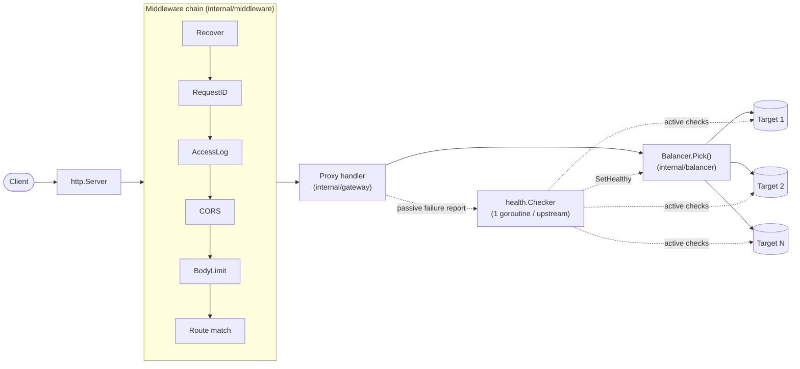

# gatekeeper

An API gateway (reverse proxy) written in Go, with a hand-rolled load
balancer, rate limiter, circuit breaker and health checker — no
off-the-shelf implementations for any of those. It's a portfolio project
built to a middle-level Go interview bar: every concurrency primitive
(atomics, mutexes, `context`, goroutine lifecycles) is used deliberately
and is meant to be explainable, not just "it works."

[](https://github.com/rosali3/gatekeeper/actions/workflows/ci.yml)

> **Status: work in progress**, built stage by stage. This README reflects
> what's actually implemented today, not the final target — see
> [Roadmap](#roadmap) for what's still missing.

## What it does today

- Routes requests by host / path prefix / method, longest-prefix-wins,
  with `strip_prefix` support.
- Load-balances across targets with three hand-written algorithms:
  `round_robin` (atomic counter), `weighted_round_robin` (nginx-style
  smooth weighted round robin), `least_conn` (atomic active-connection
  counter).
- Active health checks (one goroutine per upstream, jittered interval,
  configurable healthy/unhealthy thresholds) and passive health checks
  (a proxy error counts toward the same threshold as a failed probe).
  Unhealthy targets are skipped by every balancer; an upstream with no
  healthy target returns `503` without attempting to dial anything.
- Per-upstream timeouts via `context.WithTimeout`, so a client
  disconnecting propagates to the in-flight upstream call for free.
- `X-Forwarded-For/Proto/Host` and `X-Request-ID` (generated if absent),
  hop-by-hop header stripping — all via `net/http/httputil.ReverseProxy`,
  not reimplemented.
- Request body size limits, panic recovery (a handler panic becomes a
  500, not a crashed process), and graceful shutdown that waits for
  in-flight requests before closing.
- CORS for explicitly allow-listed origins.
- Structured JSON access logs (`log/slog`) with route/upstream/target/
  status/latency/request_id.

## Architecture



Each config generation compiles into one immutable `gateway.Snapshot`
(route table + per-upstream balancers/proxies + the fully assembled
handler chain) held behind an `atomic.Pointer`. Nothing hot-swaps yet
(that's hot reload, still to come), but the plumbing is already in place
for it.

## Quickstart

Requires Go 1.23+.

```bash
go build -o bin/gatekeeper ./cmd/gatekeeper
go build -o bin/testupstream ./cmd/testupstream

# two fake backends
ADDR=:9001 NAME=backend-1 ./bin/testupstream &
ADDR=:9002 NAME=backend-2 ./bin/testupstream &

./bin/gatekeeper --config=configs/gatekeeper.example.yaml &

curl http://localhost:8080/api/floorplan/rooms
```

`testupstream` is a small backend with configurable behavior via env vars
(`DELAY`, `ERROR_RATE`, `HEALTHY`) — handy for poking at load balancing,
timeouts and health-check eviction/recovery by hand.

## Configuration

See [`configs/gatekeeper.example.yaml`](configs/gatekeeper.example.yaml)
for a full example. Config is strict: unknown fields are a startup error,
not a silently ignored typo.

```yaml
upstreams:
  floorplan:
    balancer: least_conn
    targets:
      - { url: http://floorplan-api-1:8080, weight: 1 }
      - { url: http://floorplan-api-2:8080, weight: 1 }
    health_check: { path: /healthz, interval: 5s, timeout: 1s, healthy_threshold: 2, unhealthy_threshold: 3 }
    timeout: 30s
routes:
  - match: { path_prefix: /api/floorplan/, methods: [GET, POST] }
    strip_prefix: /api/floorplan
    upstream: floorplan
    auth: jwt
```

## Middleware order, and why

```
recover → request-id → access-log → CORS → body-limit → route-match → [auth → rate-limit → circuit-breaker] → proxy
```

- **recover** is outermost so it can catch a panic from every layer below it.
- **request-id** runs early so every later log line and the upstream
  request itself carry it.
- **access-log** wraps everything downstream of it (CORS, body-limit,
  routing, proxying) so it can report the final status/route/upstream/
  target after the whole chain has run.
- **CORS** and **body-limit** are cheap, request-shape checks that should
  reject bad requests before spending effort on routing or auth.
- **route-match** has to happen before auth/rate-limit/circuit-breaker
  because those are configured per-route.
- **auth → rate-limit → circuit-breaker → proxy** (bracketed above) is the
  order specified by the project's spec; auth/rate-limit/circuit-breaker
  aren't implemented yet, so today route-match hands off straight to the
  proxy handler.

## Testing

```bash
go test ./...              # unit + integration tests (httptest-backed)
go test -race ./...        # race detector (needs a C toolchain / cgo)
go vet ./...
golangci-lint run ./...
```

Goroutine-leak checks (`go.uber.org/goleak`) run in every package that
starts background goroutines (health checkers), via `TestMain`.

Current coverage:

| Package | Coverage |
|---|---|
| `internal/balancer` | 100% |
| `internal/gateway` | 100% |
| `internal/logger` | 100% |
| `internal/reqctx` | 100% |
| `internal/router` | 100% |
| `internal/middleware` | 98.5% |
| `internal/health` | 94.7% |
| `internal/config` | 92.4% |

CI (`.github/workflows/ci.yml`) runs `go vet`, `go test -race` with
coverage, and `golangci-lint` on every push.

## Roadmap

Built stage by stage; each stage lands with green tests and its own
commit(s) before moving on.

- [x] Config loading/validation, structured logging, test upstream
- [x] Router, `ReverseProxy`, headers, timeouts, graceful shutdown
- [x] Balancers (round robin, weighted round robin, least conn) + active/passive health checks
- [ ] Rate limiting: local token bucket, then Redis-backed distributed limiting
- [ ] Auth: API key (constant-time compare), JWT/JWKS
- [ ] Circuit breaker + retries with a budget
- [ ] Hot reload (SIGHUP/fsnotify, atomic config swap) + admin API
- [ ] Metrics (Prometheus), tracing (OpenTelemetry), Grafana dashboard
- [ ] Benchmarks, load test, docker-compose demo, ADRs, interview Q&A doc

## What's deliberately not done

Not in scope for this project: TLS termination, WebSocket proxying,
HTTP/2 to upstreams. These are called out explicitly (rather than just
silently unsupported) because a gateway that's simple by design still
needs to be honest about its edges.
